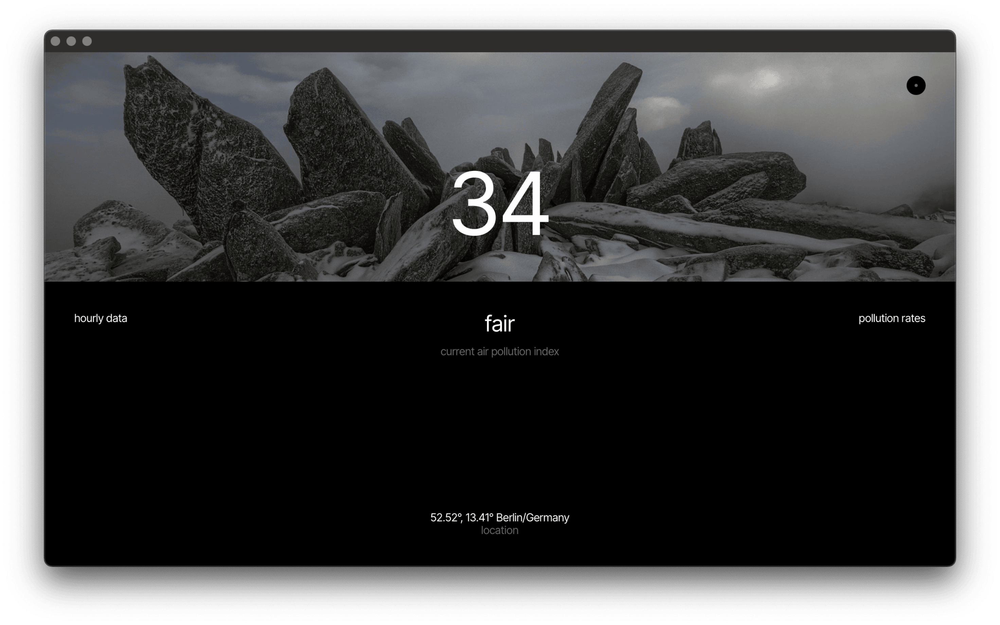

# Pollution App Native
<br>
The Application shows the current air quality index along with hourly rates for each pollutant.
<br>
<br>



Native version of [Pollution App](https://github.com/HelloXiuXiu/pollution-app) (React + Vite web application). <br> Built with [Socket Runtime](https://github.com/socketsupply/socket). <br>
Tutorial: [YouTube](https://youtu.be/tLvwK0o8ttg?si=AfZpDlkdxKRIBv5r)
<br>
<br>
Install dependencies: 
<br>

```sh
npm i
```
Run:
```sh
npm start
```
