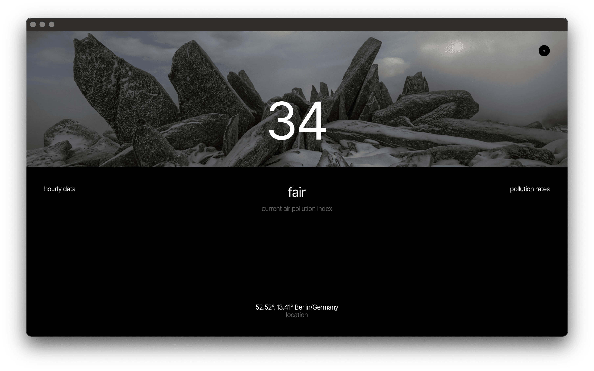

# Pollution App Native

 
The Application shows the current air quality index along with hourly rates for each pollutant.
 
 

Native version of [Pollution App](https://pollution-react-app.netlify.app/).  
Built with [Socket Runtime](https://github.com/socketsupply/socket).  
Tutorial: [YouTube](https://youtu.be/tLvwK0o8ttg?si=AfZpDlkdxKRIBv5r).
